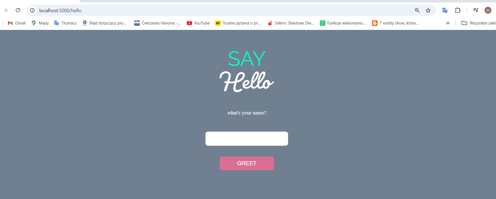

# Flask Docker App 🚀

A simple Flask web application running inside a Docker container. This project provides a basic example of how to deploy a Flask application using Docker and is ready for deployment on Heroku or Render.



## 📌 How to Run the Application

1. **Clone the repository**
   ```sh
   git clone https://github.com/MMuzykant00/flask-docker-heroku.git
   cd flask-docker-heroku
   ```

2. **Build the Docker image**
   ```sh
   docker build -t flask-app .
   ```

3. **Run the container**
   ```sh
   docker run -d -p 5000:5000 --name flask-container flask-app
   ```

4. **Check the application**
   Open your browser and visit:
   ```
   http://localhost:5000/hello
   ```
# Flask App Deployed on Render

This Flask app is deployed on Render. Access it here:
👉 [https://flask-app-lqoh.onrender.com](https://flask-app-lqoh.onrender.com)

## Available Routes
- `/` - Home page (redirects to /hello)
- `/hello` - Returns a greeting message

## 🔥 Managing the Container
- **Stop the container:**
  ```sh
  docker stop flask-container
  ```
- **Remove the container:**
  ```sh
  docker rm flask-container
  ```
- **Remove the Docker image:**
  ```sh
  docker rmi flask-app
  ```


